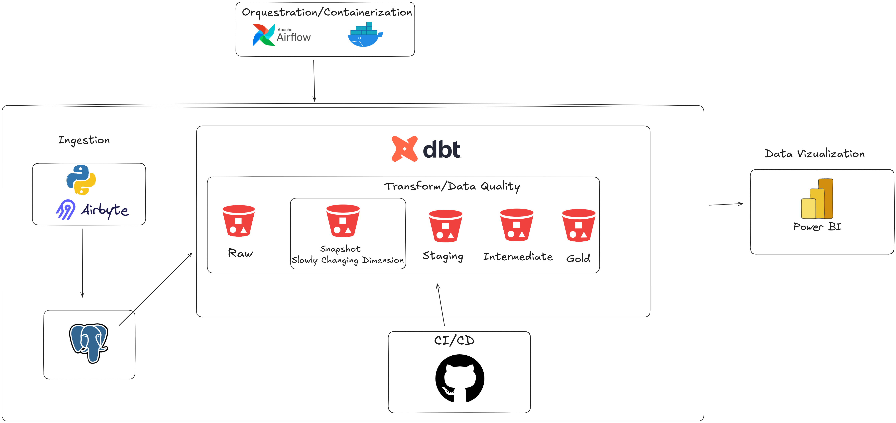

# Documentação da Pipeline: Projeto `dbt_az_usuarios`

## 1. Arquitetura do Projeto

A imagem abaixo apresenta a arquitetura geral do projeto `dbt_az_usuarios`. Essa arquitetura detalha os componentes principais e o fluxo de dados desde a coleta até a visualização.

- **Airbyte** realizando a ingesta de dados para o banco de dados **PostgreSQL**.
- **dbt-core** executando transformações de dados no banco de dados.
- **Power BI** conectando-se ao banco de dados transformado e criando dashboards.

---

## 2. Descrição Geral do Projeto

O projeto `dbt_az_usuarios` é uma solução de monitoramento e análise de dados de sistema de login. Ele foi projetado para capturar, transformar e apresentar informações relevantes sobre os usuários, sistemas utilizados, ações realizadas e os navegadores usados. Os dados coletados oferecem insights para entender os comportamentos dos usuários, detectar possíveis problemas e otimizar a experiência do usuário.

### 2.1. Objetivo do Projeto

- Capturar e monitorar dados de interação dos usuários com o sistema de login.
- Prover transformações eficientes dos dados para análise.
- Criar dashboards no Power BI para visualização e tomada de decisão.

### 2.2. Estrutura dos Dados

Os dados capturados incluem:

- **Usuário:** Identificação do usuário.
- **Sistema:** Nome do sistema ou aplicação utilizada.
- **Ação:** Ação realizada pelo usuário (e.g., login, logout, atualização).
- **Navegador:** Tipo e versão do navegador utilizado.
- **Timestamp:** Data e hora da ação registrada.

---

## 3. Pipeline de Dados

### 3.1. Coleta de Dados (Airbyte)

- **Ferramenta:** Airbyte
- **Função:** Extrair dados gerados pelos sistemas de login e enviá-los ao banco de dados PostgreSQL.
- **Configuração:**
  - Fonte: Logs do sistema de login.
  - Destino: Banco de dados PostgreSQL.

### 3.2. Armazenamento de Dados (PostgreSQL)

- **Função:** Armazenar os dados brutos coletados.
- **Estrutura:** Dados organizados em tabelas baseadas nas entidades capturadas (usuário, sistema, ação, navegador).

### 3.3. Transformação de Dados (dbt-core)

- **Ferramenta:** dbt-core
- **Função:** Realizar transformações nos dados brutos para estruturar tabelas prontas para análise.
- **Modelos Criados:**
  - `usuarios_clean`: Normalização e limpeza de dados de usuários.
  - `acoes_analise`: Agregação de dados sobre ações realizadas.
  - `navegadores_insights`: Identifica os navegadores mais utilizados.

### 3.4. Visualização de Dados (Power BI)

- **Ferramenta:** Power BI
- **Função:** Criar dashboards interativos para visualização de:
  - Quantidade de acessos por usuário.
  - Ações mais frequentes realizadas.
  - Navegadores mais utilizados.
  - Tendências de uso ao longo do tempo.

---

## 4. Benefícios do Projeto

- **Monitoramento em Tempo Real:** Dados atualizados continuamente permitem a tomada de decisão ágil.
- **Otimização do Sistema:** Insights podem ser usados para melhorar a experiência dos usuários.
- **Flexibilidade e Escalabilidade:** Arquitetura modular facilita expansões futuras.

---

## 5. Considerações Finais

O projeto `dbt_az_usuarios` representa uma solução robusta para captura, transformação e análise de dados de interação com sistemas de login. O uso de ferramentas modernas como Airbyte, dbt-core e Power BI garante eficácia e escalabilidade, atendendo às necessidades de monitoramento e análise de dados empresariais.
